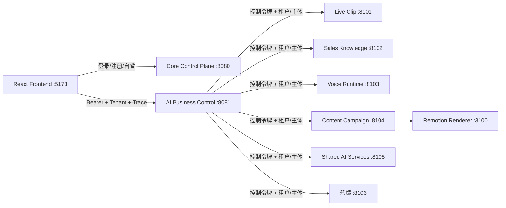

# AIPlatform 架构与功能完成度审计

> 审计日期：2026-08-04  
> 审计范围：当前工作区全部生产源码、测试、启动脚本、运行时清单、契约与基础设施目录，包括尚未提交的蓝鲲智能体集成。  
> 判定口径：以可运行代码和测试证据为准，不把规划文档、静态页面、示例数据或接口占位视为已完成业务能力。

## 1. 结论先行

当前仓库已经是一个可以统一启动、具有多个真实 AI 工作流的**集成开发平台**，但还不是可以承载真实商家数据和资金相关动作的**生产级多租户电商运营平台**。

已经形成的工程主体包括：

- React 统一前端、Core Identity 控制面、AI Business 控制面。
- 直播切片、销售知识、实时语音、内容运营、共享 AI 服务、蓝鲲六类 AI Runtime，以及 Remotion 视频渲染器。
- 登录与租户上下文、控制面代理、运行时控制令牌、Trace 请求头、九个工作台入口和统一启停脚本。
- 内容生成、直播切片、知识加工与考核、语音会话状态、共享 MCP 能力、四种通用 Agent 等可演示功能。

尚未形成的生产脊柱包括：

- 持久化身份、RBAC/ABAC、店铺级授权、服务身份和审计。
- 真实渠道连接器，以及店铺、商品、SKU、库存、订单、售后的权威业务事实。
- 可靠消息、Outbox、幂等、租约、重试、死信和可重放任务状态机。
- 统一模型网关的真实强制路由、Trace、Token/成本计量、预算、评测、灰度与回滚。
- 对象存储、资产版本/版权/谱系、可恢复的长任务，以及生产基础设施和可观测性。

因此，当前最准确的定位是：**多个成熟度不一的 AI Demo 已成功融合到统一壳层和部分控制面，但端到端经营闭环仍被身份、渠道、交易事实、持久化和治理五个断点截断。**

## 2. 审计原则

本次用以下第一性原则判断“功能完成”：

1. **事实唯一**：一个业务事实必须有唯一权威拥有者，其他模块只能持有投影或引用。
2. **权限可证**：每次读写必须能追溯到租户、主体、资源范围和授权决策，不能只依赖前端隐藏入口。
3. **接受即不丢**：系统一旦接受命令，进程重启、网络超时和重复投递不能导致任务丢失或副作用重复。
4. **外部动作有回执**：发布、退款、发送消息等动作必须经过受控命令、幂等执行和回执对账。
5. **AI 默认不可信**：模型输出必须绑定输入版本、Prompt/模型版本、证据、用量、成本和评测结果。
6. **运行态可恢复**：长任务必须具备持久状态、attempt、租约、超时、重试、取消和死信处理。
7. **页面不等于能力**：静态 UI、内存 CRUD、Mock Provider 和固定指标只能证明交互或契约，不能证明生产闭环。

成熟度定义：

| 级别 | 含义 |
| --- | --- |
| L0 | 无实现，仅有规划 |
| L1 | 有页面或接口占位，可展示结构 |
| L2 | 单进程/内存 Demo 可用，缺生产数据和恢复能力 |
| L3 | 已接入统一平台并具有真实工作流，但依赖或治理尚未闭环 |
| L4 | 持久、隔离、可恢复、可观测、可审计，具备生产验收证据 |

当前没有任何业务域达到 L4。

## 3. 当前真实架构

### 3.1 逻辑拓扑



前端只直接访问两个 Java 控制面。AI Business 校验 Core 令牌和租户成员关系，再代理到各 Runtime；统一启动脚本为内部调用生成控制令牌。这个边界方向是正确的，但只有部分 Runtime 真正按租户存储和过滤数据。

### 3.2 当前部署单元

| 部署单元 | 地址 | 当前职责 | 当前主要状态存储 |
| --- | --- | --- | --- |
| Frontend | `http://127.0.0.1:5173` | 登录、平台总览、九个工作台 | 浏览器会话状态 |
| Core Control Plane | `http://127.0.0.1:8080` | 登录、注册、自省、租户列表 | 进程内存 |
| AI Business Control | `http://127.0.0.1:8081` | 租户认证、业务 API、Runtime 代理、内存治理元数据 | 进程内存 |
| Remotion Renderer | `http://127.0.0.1:3100` | 内容视频渲染 | 文件/进程状态 |
| Live Clip Runtime | `http://127.0.0.1:8101` | 上传、ASR/LLM 处理、片段任务 | 本地文件/进程状态 |
| Sales Knowledge Runtime | `http://127.0.0.1:8102` | ETL、标注、素材、学员、考核、导出 | 本地/可选外部依赖/进程状态 |
| Voice Runtime | `http://127.0.0.1:8103` | 实时语音服务状态和动作接口 | 进程状态/可选 RTC |
| Content Campaign Runtime | `http://127.0.0.1:8104` | 内容工作流、品牌、模板、日历、海报、视频 | 本地/进程状态 |
| Shared AI Services | `http://127.0.0.1:8105` | LLM、RAG、记忆、Prompt、工具共享服务 | 当前统一启动为 memory 模式 |
| 蓝鲲 Runtime | `http://127.0.0.1:8106` | 联网问答、文件 RAG、PPT、深度研究 | 可选 MySQL/MinIO/PGVector，失败时部分回退内存 |

### 3.3 当前代码边界

- `backend/core-control-plane`：身份控制面。
- `backend/ai-business-control`：内容资产、内容运营、客服、知识、共享 AI、治理、分析、Agent 的 Java 业务边界和 Runtime 代理。
- `ai/media-workers`：媒体长任务与直播切片。
- `ai/runtime/modules`：内容、客服和共享 AI 的 Python 运行面。
- `dodo-agent`：蓝鲲独立 Spring AI Agent 运行面。
- `frontend`：统一工作台。
- `packages/contracts`：计划中的跨模块 JSON Schema，目前未进入生产调用链。
- `infra`、`data/analytics`：当前基本为空，仅保留目标目录。

## 4. 本轮已落地的架构优化

这些修改已经进入当前工作区，并经过相应测试或构建验证：

### 4.1 启动与健康语义

- 统一健康检查从“任何 `<500` 响应都算健康”收紧为仅接受 `2xx`。
- 401、404、配置错误等可达但不可用状态不再被误判为 ready。
- 统一启动脚本仍为各进程注入同一临时 Runtime 控制令牌，不把令牌写入仓库配置。

### 4.2 身份安全默认值

- Core 的 `admin/123` 开发种子默认关闭。
- 仅统一本地运行清单和测试显式开启开发种子，避免其他环境意外暴露弱口令。
- 租户集合返回顺序改为确定顺序，降低 UI 和测试的不稳定性。

### 4.3 蓝鲲 Runtime 边界加固

- 控制令牌未配置时，受保护接口返回 503，不再采用 fail-open。
- 强制要求 `X-Tenant-Id` 和 `X-Subject-Id`。
- Actuator 增加安全配置健康指标；控制令牌缺失时整体为 DOWN。
- 文件 ID、会话 ID 均包含并校验租户/主体命名空间。
- 会话列表、详情和删除在数据库查询层增加范围过滤，避免只靠控制器事后判断。
- 增加 Runtime 认证、健康状态和租户资源范围测试。

### 4.4 内部 Agent 协议

- Java 控制面到蓝鲲的 Prompt 从 GET 查询串迁移为 JSON POST，避免 Prompt 出现在 URL、代理日志和浏览器历史中。
- 蓝鲲保留原 GET 接口以兼容原项目，但平台内部只使用 POST。
- Agent 日志只记录 Prompt 长度，不记录正文。
- Java 代理测试验证路由、POST 方法、JSON 请求体和租户/主体会话命名空间。

### 4.5 前端与注册表

- 蓝鲲加入 Runtime Registry 和平台第九个入口。
- 蓝鲲导航入口固定在“平台总览”下方；会话记录在左侧蓝鲲入口下展开，并占满到管理员区域上沿，超出可用高度后内部滚动。记录按租户写入浏览器本地存储，最多保留 30 条并支持刷新恢复。
- 蓝鲲新会话默认进入“问题”模式；文件上传成功后才进入文件问答，PPT 创作和深度研究改为输入框内的图标模式按钮，避免顶部模式 Tab 和隐式切换。
- 顶层工作台改为路由级懒加载；主入口包从约 `520.57 kB` 降到 `272.04 kB`，减少约 48%。
- 约 `1.03 MB` 的 RTC 依赖仍然较大，但已推迟到实时语音工作台真正加载时下载。
- 平台总览文案、项目目录和 E2E 入口数量从八个同步为九个。

## 5. 功能完成度矩阵

### 5.1 原八个权威业务域

| 业务域 | 当前级别 | 已完成 | 部分完成 | 未完成/不可视为完成 |
| --- | --- | --- | --- | --- |
| 项目一：租户、身份与访问控制 | L2 | 登录、注册、Bearer 会话、自省、租户列表；控制面能验证租户成员关系 | 有开发种子和基本租户上下文 | 用户/租户/会话持久化；RBAC/ABAC；店铺资源范围；邀请；MFA；密码恢复；服务身份；权益/功能开关；安全审计；会话撤销与密钥轮换 |
| 项目二：渠道连接与数据接入 | L1 | 统一前端入口和领域说明 | 无 | 连接器 SDK；OAuth/授权续期；Webhook 验签；同步游标；原始报文；标准化映射；幂等投递；渠道回执；重放和对账 |
| 项目三：电商核心业务域 | L1 | 统一前端入口和领域说明 | 无 | 店铺、商品、SKU、价格、库存、订单、售后、消费者引用；内外部 ID 映射；领域事件；受控查询/动作 Tool；审批后执行和回执状态机 |
| 项目四：内容资产与多模态加工 | L3 | 浏览器 FFmpeg；上传；切片任务；进度；ASR/LLM 适配；片段和素材 API/UI；内容运营生成物接入 | 已有控制面代理和租户入口，但任务状态主要在进程内 | 资产唯一 ID/版本；对象存储；版权与授权；内容谱系；校验和；短期签名地址；持久任务；幂等；租约；失败恢复；跨 Runtime 一致租户隔离 |
| 项目五：AI 商品内容与营销运营 | L3 | 选题/工作流、品牌、模板、日历、海报、视频、平台适配、作品库及较完整 UI/API | 内容生成链较丰富，Remotion 已接入 | 项目三权威商品事实；项目四正式资产版本；真实模型/图像 Provider 生产配置；事实校验；审核身份/权限；渠道发布；回执/撤回；实验与效果归因；统一 Trace/成本/评测 |
| 项目六：智能客服与售后协同 | L3 | 知识 ETL/标注、素材、学员、AI 考核、导出；客服知识和人工接管界面；语音运行状态；蓝鲲可补充通用问答能力 | 多个原项目能力已融合，但数据模型和运行链仍分散 | 真实渠道消息；知识库发布版本；生产向量库/LLM/TOS/RTC；订单只读 Tool；工单；退款/改址等受控动作；消费者确认；完整人工接管；质检、脱敏、审计与反馈闭环；DPO 导出 |
| 项目七：经营指标与 AI 决策分析 | L1-L2 | Runtime 健康和少量内存计数可展示 | 有分析页面骨架 | 可重放事件采集；指标语义层；数据质量；行级权限；报表/导出；内容和客服归因；异常/预测；AI 用量和成本事实。目前 `aiTraces`、`tokenUsage`、`costMicros` 固定为 0，`data/analytics` 无实现 |
| 项目八：AI 应用工程与模型治理 | L2 | 模型、API Key、Prompt、Tool、预算等元数据 CRUD；共享 LLM/RAG/记忆/Prompt/Tool 示例服务 | 具有控制面和共享服务形态 | 所有模型调用强制过网关；密钥保险库；版本绑定；真实路由/熔断；租户限流/预算；Embedding/索引生命周期；Trace/usage/evidence；评测集和回归门禁；灰度/回滚；安全策略真正执行。当前多数元数据只存在内存且不控制调用 |

### 5.2 项目九：蓝鲲通用智能体入口

蓝鲲是新增的 AI 应用工作台，不应成为第九个权威业务数据域。它应消费项目一的身份、项目四的文件资产、项目八的模型/检索/工具能力，并把业务动作委托给项目五或项目六。

| 能力 | 状态 | 说明 |
| --- | --- | --- |
| 四种 Agent 模式 | 已接入 | 联网问答、文件问答、PPT、深度研究均有 SSE 入口和统一工作台 |
| Java 控制面代理 | 已接入 | 前端不直连蓝鲲；代理传递控制令牌、租户、主体和 Trace |
| 文件上传与会话 | 已接入 | 已增加租户/主体命名空间和查询范围过滤 |
| Prompt 传输 | 已加固 | 平台内部使用 JSON POST，日志不打印正文 |
| 外部模型与搜索 | 待配置 | 蓝鲲仍沿用兼容环境变量 `DODO_OPENAI_API_KEY`；Tavily 等默认未配置，无法完成真实推理/联网搜索 |
| 持久基础设施 | 待生产化 | MySQL、MinIO、PGVector 为可选依赖；部分失败路径会退回内存，生产环境必须 fail-fast |
| 治理闭环 | 未完成 | 模型版本、Prompt 版本、Token/成本、证据、评测、预算尚未接入项目八 |

## 6. 跨域能力审查

### 6.1 已完成的集成骨架

- 一个前端和统一导航，不再要求用户分别打开五个原项目。
- 一个身份入口和一个 AI 业务入口。
- Runtime URL 集中配置、统一启停、统一健康检查。
- Java 控制面代理复用 Bearer、Tenant、Subject、Trace 和内部控制令牌。
- 内容资产、内容运营、知识/客服、分析/治理和 Agent 均有明确前端入口。
- Java/Python/Node 各自保留适合其负载的运行边界，没有强行重写原能力。

### 6.2 仍是“设计而非实现”的契约

`packages/contracts` 中已经定义 `ai-task.v1`、`ai-task-result.v1`、`ai-trace.v1`、知识发布事件等 Schema，但生产代码没有引用或校验这些 Schema。以下字段目前只是架构意图：

- `taskId`、`attempt`、`idempotencyKey`、`deadline`。
- 输入/输出资产版本和 `evidenceRefs`。
- 模型/Prompt/Tool 版本。
- Token、延迟、缓存命中和成本。
- Outbox 事件 ID、消费者位点和重放语义。

契约文件存在不能替代生产者校验、消费者契约测试、Schema 兼容策略和真实消息投递。

### 6.3 当前测试能证明什么

- Java 测试能证明主要控制器契约、代理请求头/请求体、Runtime 注册和本轮安全规则。
- Python 测试能证明各原项目的大量局部业务函数和接口行为。
- 前端 build/lint 能证明类型、打包和静态规则通过。
- 现有测试不能证明持久化重启、并发幂等、跨租户全链路、真实 Provider、渠道回执、成本计量和灾难恢复。

## 7. 对抗性风险清单

### 7.1 P0：进入真实数据或生产流量前必须解决

| 风险 | 失败方式 | 当前证据 | 必须采取的措施 |
| --- | --- | --- | --- |
| 权威状态大量在内存 | 重启后用户、会话、任务、治理配置和统计丢失 | 两个 Java 控制面及多个 Runtime 使用进程内集合/注册表 | PostgreSQL + Flyway；明确聚合、事务和唯一约束；增加重启恢复测试 |
| 授权模型不足 | 同租户越权、店铺数据横向访问、管理员能力失控 | 只有成员关系，没有角色/资源策略 | RBAC + 资源范围 ABAC；服务身份；拒绝优先；权限变更审计；跨租户/跨店铺测试 |
| 没有渠道与交易事实 | 模型基于 Mock/手工输入生成，无法安全执行业务动作 | 项目二/三只有静态入口 | 先接一个沙箱渠道；建立店铺/商品/订单只读投影和内外 ID 映射 |
| 长任务不可靠 | 重复执行、处理中断、永远卡住、取消无效 | 无统一持久任务、租约、attempt、死信 | 持久状态机 + Outbox + Worker lease + 幂等键 + 重试/死信/补偿 |
| Runtime 租户隔离不一致 | 绕过 Java 或错误透传时发生数据串租 | Live Clip 等 Runtime 数据模型缺租户字段 | 每个存储查询强制 tenant/subject；网络层禁止外部直达；控制令牌轮换；隔离集成测试 |
| AI 治理未强制执行 | 无法回答“哪个模型为何花了多少钱并产生此结果” | Trace/usage/cost 为 0，治理 CRUD 不控制实际调用 | 统一模型网关；不可绕过的调用信封；真实 usage/cost/evidence；预算硬限制 |
| 外部依赖静默降级 | 生产误用内存模式，数据在重启后消失 | 蓝鲲与共享服务支持 memory fallback | 明确 `dev`/`prod` Profile；prod 缺依赖必须启动失败；健康指标暴露实际存储模式 |

### 7.2 P1：形成首个业务闭环前解决

- 资产必须具备版本、校验和、对象存储键、版权/授权状态和衍生谱系。
- 内容审核人不能固定为 `admin`；必须来自令牌主体并记录决策、前后版本和理由。
- 移除或限制 `/debug/categories` 等调试接口。
- 导出任务不能依赖进程内注册表；导出文件应有租户范围、过期和审计。
- JSON Schema 应进入生产校验和消费者契约测试，而不是只作为文档。
- 所有外部副作用需支持幂等、回执对账、超时未知状态和人工补偿。
- 结构化日志需包含 trace/task/tenant/subject，但不得包含 Prompt、令牌、PII 或原始私密文件。
- 建立 Provider 超时、限流、熔断、重试边界，避免同步级联故障。

### 7.3 P2：规模化前解决

- 分析事实表、指标语义层、数据质量规则、回填和小样本隐私保护。
- 离线/在线评测集、Prompt/模型回归门禁、灰度和自动回滚。
- Kubernetes、数据库、对象存储、消息系统、观测栈的 IaC 与容量模型。
- 前端进一步拆分 RTC/富媒体依赖，建立性能预算和真实设备基线。
- SLO、告警、值班手册、备份恢复演练和成本容量压测。

## 8. 推荐目标架构

### 8.1 保持“逻辑八域，物理少服务”

当前阶段不应把八个项目机械拆成八个微服务。推荐保留：

1. **Core Control Plane**：身份、渠道接入和电商核心作为清晰模块，先用模块化单体获得事务一致性。
2. **AI Business Control**：资产控制面、运营、客服和 Agent 应用状态，按模块/Schema 隔离。
3. **AI Runtime**：无业务事实所有权，只执行模型、检索、编排和评测。
4. **Media Worker**：独立承载 CPU/GPU 长任务。
5. **Analytics Stack**：消费不可变事件，不反向写交易表。

拆服务的触发条件应是独立扩缩容、故障隔离、合规边界或团队所有权，而不是项目编号。

### 8.2 最小生产数据面

| 组件 | 用途 | 关键约束 |
| --- | --- | --- |
| PostgreSQL | 身份、领域聚合、任务、审计、Outbox | 所有业务表包含租户键；唯一约束承担幂等；Flyway 管理版本 |
| Redis | 短期缓存、限流、分布式租约 | 不作为唯一事实源；键包含环境和租户命名空间 |
| S3/MinIO | 原文件、衍生资产、导出物 | 私有桶、校验和、版本、短期签名地址、生命周期策略 |
| PGVector/向量服务 | 可重建检索投影 | 索引绑定租户、知识库和发布版本；源文本仍归项目四 |
| Kafka/RabbitMQ/持久队列 | 任务分发和领域事件 | Outbox 发布；消费者幂等；重试和死信；可回放 |
| OpenTelemetry | Trace、指标和日志关联 | Trace 不记录敏感正文；贯穿 Java、Python、Node 和 Provider |

### 8.3 统一同步调用信封

每次内部调用至少携带：

```json
{
  "tenantId": "tenant-id",
  "subjectId": "user-or-service-id",
  "traceId": "trace-id",
  "requestId": "request-id",
  "idempotencyKey": "business-operation-key",
  "resourceScope": {
    "shopIds": ["shop-id"]
  }
}
```

身份字段来自可信控制面，不接受浏览器任意伪造；Runtime 控制令牌只能证明调用方是控制面，不能代替租户授权。

### 8.4 统一异步任务状态机

```text
PENDING -> CLAIMED -> RUNNING -> SUCCEEDED
                         |  -> RETRY_WAIT -> CLAIMED
                         |  -> FAILED -> DEAD_LETTER
                         |  -> CANCELLING -> CANCELLED
```

任务记录至少持久化 `taskId`、租户/主体、类型、输入版本、状态、attempt、租约截止、幂等键、结果引用、错误分类、模型/Prompt 版本、usage 和时间戳。Worker 只能通过原子 claim 获得任务；租约过期后才能被其他 Worker 接管。

### 8.5 AI 调用闭环

```text
业务命令
  -> 权限/权益/预算预检
  -> 固定模型 + Prompt + Tool + 索引版本
  -> Runtime 执行并收集 evidence/usage
  -> 结构化校验与业务规则
  -> 人审或受控动作
  -> 渠道回执/业务结果
  -> 评测标签、成本和效果回流
```

项目八控制执行机制，项目五/六仍拥有“能否发布、是否转人工、是否申请业务动作”等业务决策。

## 9. 分阶段路线图

### 阶段 0：工程脊柱与生产 Profile

目标：让“接受的数据不丢、权限可证、环境不会静默降级”。

- 为 Core 和 AI Business 建立 PostgreSQL/Flyway，先持久化身份、租户、成员、会话、任务、审计和 Outbox。
- 建立基础角色与店铺资源范围；加入服务身份和 Runtime 令牌轮换。
- 定义 `dev/test/prod` Profile；prod 禁止弱口令、内存存储和 Placeholder Provider。
- 将 `ai-task`、`ai-task-result`、`ai-trace` Schema 接入生产校验和契约测试。
- 增加重启恢复、重复命令、并发 claim、跨租户和故障注入测试。
- 初始化本地基础设施与观测配置，而不是保留 `.gitkeep`。

验收闸门：重启不丢已接受任务；相同幂等键不产生第二次副作用；跨租户请求全部拒绝；缺生产依赖时启动失败。

### 阶段 1：首个内容经营闭环

目标：证明平台能使用真实业务事实完成一次可审计价值交付。

- 项目二接一个真实沙箱渠道和文件导入适配器。
- 项目三落地店铺、商品、SKU、价格、库存、订单只读投影。
- 项目四落地对象存储、资产版本、版权和谱系。
- 项目八从第一条真实模型调用开始记录版本、Trace、Token、成本和证据。
- 项目五打通“选商品/资产 -> 生成 -> 事实校验 -> 人审 -> 发布/导出 -> 回执”。

验收闸门：任意发布内容可反查商品事实版本、资产版本、模型/Prompt 版本、审核主体、渠道回执和总成本。

### 阶段 2：客服与知识闭环

目标：让知识问答和业务查询可控、可纠错。

- 建立项目四源文档、项目六发布清单、项目八索引投影三方版本关系。
- 接入一个渠道消息流、订单只读 Tool、人工接管和工单。
- 退款/改址等只生成结构化申请，必须经规则/确认/审批后由项目三执行。
- 将错误答案、引用缺失、转人工原因和人工纠错加入评测集。
- 蓝鲲文件问答改为消费正式资产和索引版本，而不是形成第二套文件事实。

验收闸门：答案有引用；越权订单不可查询；高风险动作不能被模型直接执行；纠错能够进入回归评测。

### 阶段 3：经营反馈闭环

目标：用真实结果判断内容和客服价值。

- 建设项目七事件采集、指标语义层、数据质量和回放。
- 关联内容版本、发布回执、曝光/点击/转化/退款/投诉。
- 关联自动回复、人工接管、一次解决率、满意度和工单结果。
- 同屏展示质量、业务效果、Token、成本和延迟，而不是只展示调用量。

验收闸门：指标可追溯到不可变事实；回填可重复；租户和店铺行级权限生效；成本与 Provider 账单可对账。

### 阶段 4：规模化治理

目标：扩展能力而不扩大不可控风险。

- 模型/Prompt 灰度、自动回归门禁和回滚。
- 多渠道、多店铺、实时语音和多模态 Worker 扩容。
- SLO、容量、备份恢复、灾难演练、合规留存和成本优化。
- 只有满足独立扩缩容或故障域条件的模块才拆成独立服务。

## 10. 明确的未完成项清单

以下事项不能因已有同名页面、接口或文档而标记完成：

- [ ] 身份、租户、会话、业务任务和治理配置持久化。
- [ ] RBAC/ABAC、店铺级范围、服务身份、MFA、邀请和审计。
- [ ] 至少一个真实渠道连接器、Webhook、游标、原始证据和回执对账。
- [ ] 店铺、商品、SKU、库存、订单、售后权威模型和领域事件。
- [ ] 对象存储、资产版本、版权、谱系和持久媒体任务。
- [ ] 可靠队列、Outbox、幂等、租约、重试、死信和补偿。
- [ ] 内容事实校验、真实审核身份、渠道发布和效果实验闭环。
- [ ] 知识发布版本、生产向量索引、订单 Tool、工单和高风险动作审批。
- [ ] 统一 Trace、Token、成本、证据、预算、评测、灰度和回滚。
- [ ] 分析事件栈、指标语义层、数据质量、归因和行级权限。
- [ ] 蓝鲲生产模型/搜索/数据库/对象存储/向量库配置及 fail-fast。
- [ ] DPO 导出、调试接口治理、导出任务持久化。
- [ ] Kubernetes/local/observability 基础设施实现和恢复演练。
- [ ] 持久化重启、并发幂等、跨租户全链路、真实 Provider、成本对账测试。

## 11. 验证证据

截至本报告生成时：

| 范围 | 结果 |
| --- | --- |
| Core Control Plane | 4 passed |
| AI Business Control | 28 passed |
| 蓝鲲 Runtime | 6 passed |
| Java 合计 | **38 passed，0 failure，0 error** |
| Content Campaign Runtime | 78 passed |
| Sales Knowledge Runtime | 43 passed |
| Live Clip Runtime | 11 passed |
| Shared AI Services | 8 passed |
| Voice Runtime | 4 passed |
| Python 合计 | **144 passed** |
| Frontend | build 通过；lint 通过；Playwright E2E 通过；主包约 272.04 kB |
| 统一运行时 | 10 个部署单元全部监听，全部健康端点返回 2xx；6 个 AI Runtime 均注册为 online，包含蓝鲲 |
| Agent 实际链路 | 经 Core 登录和 AI Business 代理的 JSON POST/SSE 返回 200；缺模型 Key 时明确返回配置错误 |
| 在线拒绝测试 | 绕过控制面直连蓝鲲返回 401；匿名业务请求返回 401；伪造租户返回 404 |

已知测试噪声：Content Campaign 约 51 条、Sales Knowledge 约 142 条弃用警告，需要在依赖升级前清理。警告不影响当前用例通过，但继续累积会掩盖真实兼容性问题。

这些结果是开发基线，不是生产验收。缺失的关键测试已列在第 10 节。

## 12. 下一次验收应回答的问题

1. 重启任意控制面或 Worker 后，哪些已接受命令能够自动恢复？
2. 相同业务命令提交十次，外部渠道究竟执行几次？
3. 租户 A 能否通过猜测 ID、文件名、会话 ID 或直连 Runtime 读取租户 B 数据？
4. 某条内容中的价格来自哪个商品版本，审核人是谁，最终发布回执是什么？
5. 某条客服回答引用了哪个文档发布版本，为什么没有转人工？
6. 某次 Agent 运行使用了哪个模型、Prompt、Tool 和索引版本，消耗多少 Token 和成本？
7. Provider 超时、返回 429、部分流中断或数据库故障时，状态能否收敛并允许安全重试？
8. 数据删除、租户注销、密钥泄露和备份恢复是否有可执行流程？

只有这些问题能够由持久数据、Trace、审计、回执和自动化测试共同回答，平台才从“集成 Demo”进入“可运营系统”。
