# 五个 AI 项目源码审查与商媒智营融合架构

> 审查范围：`D:\Code\懂王\代码` 下的五个项目  
> 目标平台：`D:\Code\AIPlatform`（商媒智营）  
> 审查日期：2026-07-23  
> 结论口径：本文件先描述源码事实，再给出融合决策；两者不可混为一谈。

## 0. 结论先行

五个外部项目不应该复制成商媒智营下的五个新产品，也不应该形成“一个项目一个微服务”的物理结构。它们提供的是若干可复用能力：媒体切片、数据治理与销售考核、实时语音、内容运营工作流，以及 AI 共享服务治理。这些能力应被吸收到商媒智营已有的八个业务域中。

最终仍保持 **8 个逻辑业务域、6 类首期运行单元**：

| 逻辑域 | 吸收的外部能力 | 首期运行单元 |
| --- | --- | --- |
| 1. 租户与访问控制 | 五项目缺失的租户、成员、服务身份和审计边界 | Java `core-control-plane` |
| 2. 渠道连接 | 外部平台、微信/电商渠道数据接入思想 | Java `core-control-plane` |
| 3. 电商业务 | 商品、订单、售后事实；不由 AI 项目自行持有 | Java `core-control-plane` |
| 4. 内容资产 | AI 切片、素材、报告、OCR/ASR、媒体衍生物 | Java `ai-business-control` + Python `media-workers` |
| 5. 内容运营 | AI 运营的选题、日历、品牌、海报、视频、平台适配 | Java `ai-business-control` + Python `ai/runtime` |
| 6. 智能客服 | 聊天证据、知识发布、语音接待、销售训练与考核 | Java `ai-business-control` + Python `ai/runtime` |
| 7. 经营分析 | 内容效果、销售考核、AI 用量与质量分析 | `data/analytics` |
| 8. 模型与服务 | 模型网关、Prompt、工具目录、配额、Trace、评测 | Python `ai/runtime`，治理写操作由 Java 控制 |

外部项目中的 SQLite、PostgreSQL、ChromaDB、pgvector、微信数据库、模型密钥、RTC Token、生成文件和知识数据均不迁入。首期只定义端口和内存适配器，界面明确显示“未接入”。

---

## 1. 审查方法与判断原则

### 1.1 审查方法

本次没有只读 README，而是沿着以下路径做源码级追踪：

1. 从浏览器/CLI/HTTP 入口找到真实请求。
2. 从路由进入服务、状态机、Worker 或 Agent。
3. 追踪状态写入、异步边界、第三方调用和最终输出。
4. 检查重试、恢复、鉴权、租户隔离、日志、成本和删除行为。
5. 将“值得复用的能力”与“必须重做的实现”分开。

### 1.2 第一性原理

平台的基本目标不是“把五套代码跑起来”，而是让运营人员在一个可信系统里完成闭环：

```text
业务事实/原始证据
  -> 受控 AI 或媒体任务
  -> 可解释的候选结果
  -> 人工审核或明确授权
  -> 发布/服务/考核动作
  -> 效果、成本、质量回流
```

由此得到六条不可破坏的不变量：

1. **租户身份不可由调用方参数声明。** `tenant_id`、用户、店铺范围和用途必须由可信控制面注入。
2. **原始证据不可被 AI 结果覆盖。** 聊天、素材、订单、录音和报告是事实；摘要、标签、向量和评分是可重建投影。
3. **AI 不直接完成高风险业务写入。** 发布、退款、工单结案、人员考核等动作必须经过规则或人工审批。
4. **耗时工作必须任务化。** ASR、视频、批量生成、索引、评测必须有持久状态、幂等键、租约、重试和取消。
5. **输出必须可追溯。** 每个结果都关联输入版本、Prompt 版本、模型路由、工具调用、引用证据、成本和审核记录。
6. **可替换投影不能成为唯一事实源。** 搜索索引、向量索引、缓存和分析表均可从权威数据重建。

---

## 2. 项目一：AI 切片

### 2.1 技术栈与代码入口

| 层 | 技术与职责 | 关键源码 |
| --- | --- | --- |
| 前端 | React/TypeScript；FFmpeg.wasm 本地提取音频和导出视频片段 | `frontend/src/pages/UploadPage.tsx`、`TaskDetailPage.tsx`、`services/audioExtractor.ts`、`videoClipExporter.ts` |
| API | FastAPI；上传、任务、切片及 SSE 进度 | `backend/app/api/upload.py`、`tasks.py`、`clips.py` |
| 任务执行 | 进程内 asyncio Worker 池，从数据库领取待处理任务 | `backend/app/services/task_runner.py` |
| AI 流水线 | Groq Whisper ASR、DeepSeek 片段分析、标题和剪辑指南 | `backend/app/workers/pipeline.py`、`transcriber.py`、`analyzer.py` |
| 状态 | SQLAlchemy `Task`、`Clip`；本地文件目录 | `backend/app/models/database.py` |

### 2.2 真实组件架构

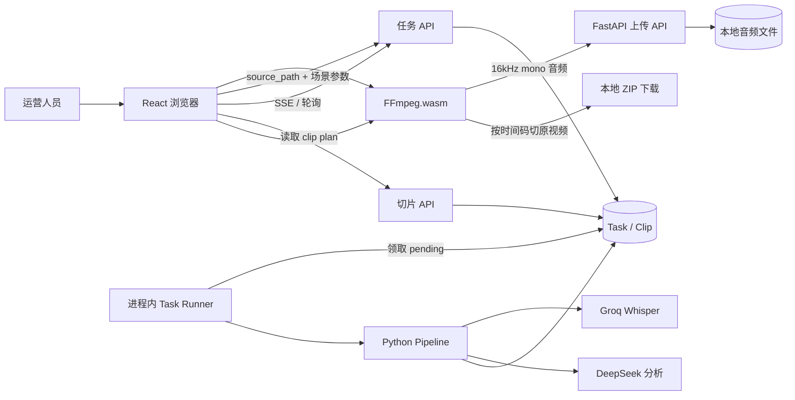

关键变化是：主流程不再把原视频传给服务端。浏览器先提取压缩音频，服务端只做转写和片段规划，最终裁剪仍由浏览器对本地原视频执行。这能显著降低上传带宽与服务端存储，但也意味着浏览器关闭后无法由服务端独立产出最终 MP4。

### 2.3 主业务流：上传到导出

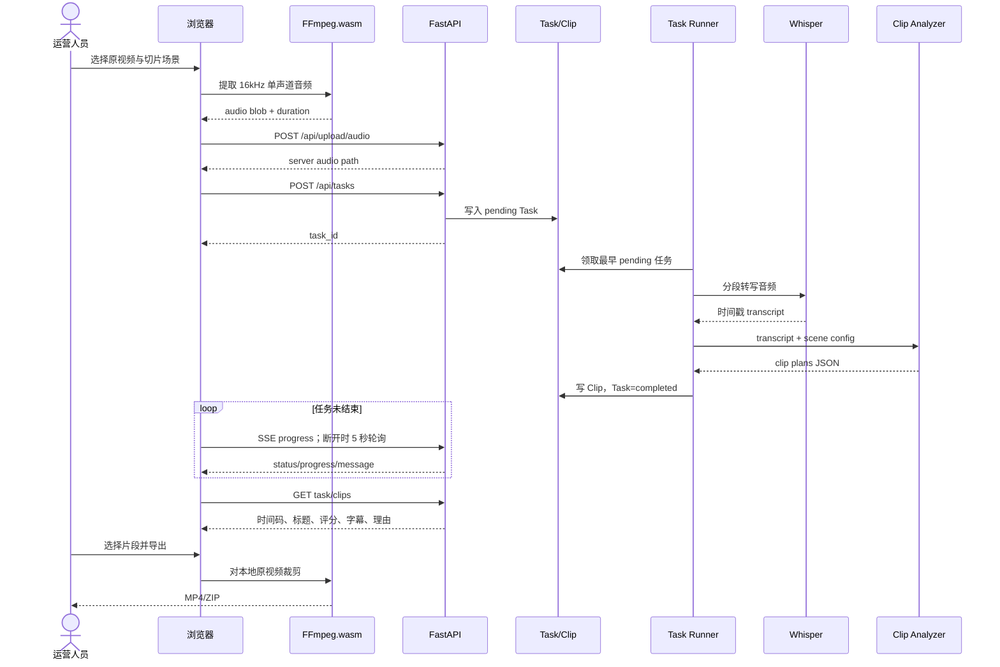

### 2.4 状态与辅助流程

```text
pending -> processing -> completed
                    \-> failed -> retry -> pending
```

- `POST /api/tasks/{id}/retry` 会清理失败状态并重新排队。
- `DELETE /api/tasks/{id}` 会删除任务及关联输出。
- `POST /api/clips/{id}/viral-titles` 按单片段再调用 LLM 生成标题。
- `POST /api/clips/{id}/editing-guide` 生成剪辑节奏、字幕、B-roll 等指南。
- SSE 本质上轮询数据库，不是 Worker 事件总线；前端另有轮询兜底。

### 2.5 输入、输出与所有权

| 阶段 | 输入 | 输出 | 目标平台的权威所有者 |
| --- | --- | --- | --- |
| 资产登记 | 原视频元信息、音频衍生物 | `asset_id`、版本、版权与保留策略 | 内容资产域（Java） |
| ASR | 音频资产版本 | 带时间戳 transcript | Python Worker 产出，内容资产域登记 |
| 切片规划 | transcript、场景、时长范围 | clip plan、分数、理由 | 内容资产域的 AI 衍生版本 |
| 媒体导出 | 原视频、已审核 clip plan | MP4/ZIP | 浏览器 MVP；后续媒体 Worker |

### 2.6 对抗性审查

| 问题 | 失败方式 | 融合要求 |
| --- | --- | --- |
| 无租户/用户授权 | 任意调用者可列出、读取、删除任务和片段 | Java 创建租户级任务，Python 仅凭短期服务令牌回写 |
| `source_path` 由请求提交 | 可引用他人上传或服务器可见路径 | API 只接受不透明 `asset_version_id`，服务端解析受控路径 |
| 进程内领取锁 | 多 Uvicorn 实例可能重复领取同一任务 | 数据库条件更新/队列租约；至少一次投递 + 幂等结果 |
| 重启恢复粗糙 | processing 被整体重置，可能重复计费 | 任务阶段 checkpoint、attempt、lease_until、retry policy |
| 浏览器承担最终导出 | 关页、低内存设备或大视频会失败 | MVP 保留；增加可选服务端异步导出通道 |
| LLM 输出信任过强 | 非法时间码、重叠、超长或 JSON 失败 | JSON Schema、时间范围校验、自动修复与人工审核 |

### 2.7 融合结论

- **复用**：浏览器音频提取、时间戳 ASR、切片计划、浏览器 FFmpeg 导出体验。
- **改造**：任务控制、身份、状态、重试、审计改由 Java；AI/媒体执行留在 Python。
- **拒绝**：路径型 API、进程内队列、跨用户列表、无授权删除。
- **落位**：项目四“内容资产”下的“直播切片”工作台。

---

## 3. 项目二：AI 数据中台、多模态与销售考核

### 3.1 技术栈与领域组成

该项目不是单一数据中台，而是五类能力共存的组合系统：

1. 微信聊天 SQLite 数据 ETL 与浏览。
2. 原始会话清洗、人工标注、知识发布和训练集导出。
3. 素材/报告管理、对象存储上传、脱敏与学员绑定。
4. 销售试卷生成、作答、AI 评分与人工复核。
5. 检索、RAG 问答、合成数据生成与多种训练格式导出。

| 层 | 技术 | 关键源码 |
| --- | --- | --- |
| 前端 | React/TypeScript | `frontend/src/appRoutes.ts`、`frontend/src/api.ts` |
| API | FastAPI，同步 SQLAlchemy 路由为主 | `backend/app/routers/*` |
| 数据 | SQLite/PostgreSQL；可选 pgvector | `backend/app/models/chat.py`、`database.py` |
| AI | sentence-transformers、OpenAI 兼容 LLM、视觉模型 | `services/embedding.py`、`rag.py`、`quiz.py`、`vision_service.py` |
| 对象存储 | 火山 TOS | `services/tos_service.py` |

### 3.2 总体架构

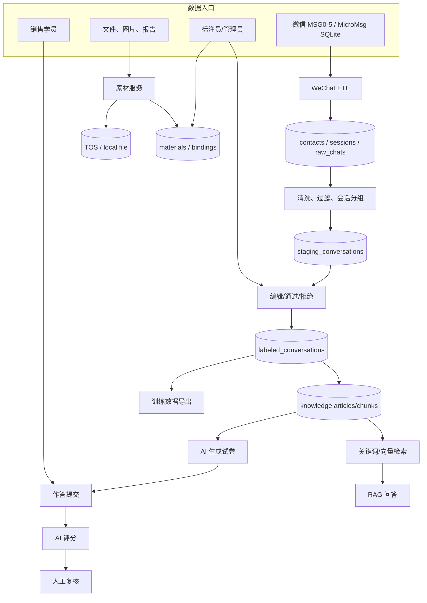

### 3.3 流程 A：微信聊天 ETL 到人工标注

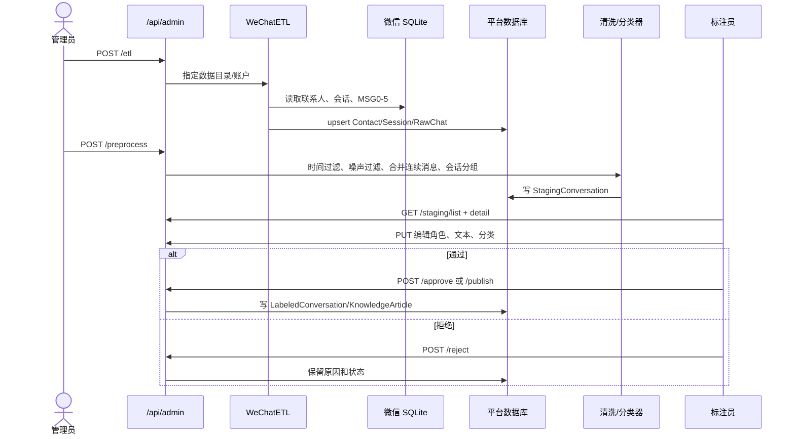

数据生命周期应保持单向谱系：

```text
RawChat（不可变证据）
  -> StagingConversation（可重算候选）
  -> LabeledConversation（人工确认版本）
  -> KnowledgeArticle / TrainingExport（带来源版本的发布投影）
```

训练导出不能反向修改聊天证据，知识条目也不能成为聊天原文的替代品。

### 3.4 流程 B：素材、销售报告与学员绑定

```text
管理员创建素材元数据
  -> 客户端直传/服务端上传对象存储
  -> 保存文件类型、标签、用途、脱敏状态
  -> 对报告执行视觉识别或人工确认
  -> 创建/导入学员
  -> 将一个或多个报告绑定学员
  -> 指定主报告
  -> 客服、训练或内容流程只通过受控引用读取
```

主要接口覆盖素材 CRUD、文件夹、上传签名、报告绑定、学生 CRUD、批量/AI 图片导入。目标平台中，文件本体属于“内容资产”，学员训练关系属于“智能客服/销售训练”，两者通过 `asset_id` 引用，不共享表。

### 3.5 流程 C：销售考核

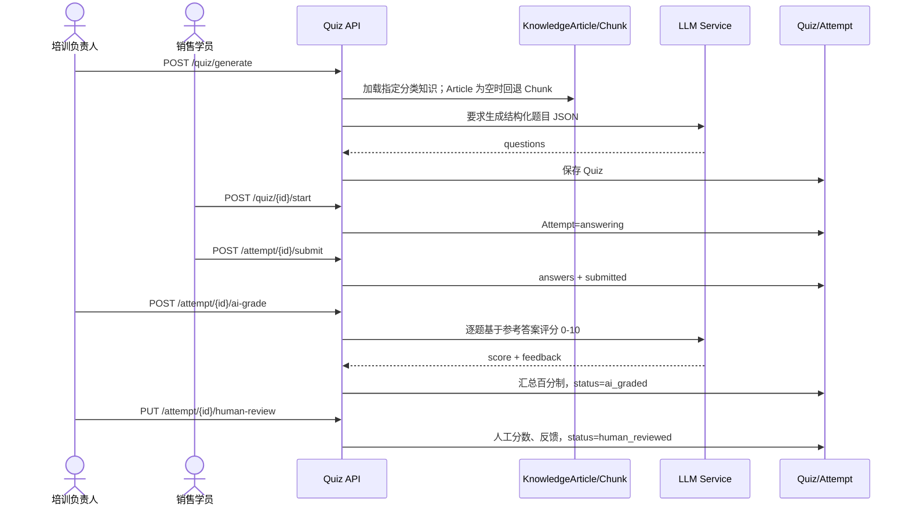

AI 分数只能作为建议。最终考核必须保留评分量表版本、题目来源、模型与 Prompt 版本、逐题证据、人工修改人和修改理由。

### 3.6 流程 D：检索、RAG 和训练导出

```text
已发布知识/标注会话
  -> 文本清洗与分块
  -> Embedding（可选）
  -> 关键词/向量召回
  -> 上下文拼装
  -> LLM 回答 + 引用

已审核会话
  -> 价格/隐私脱敏
  -> 角色与轮次校验
  -> 质量评分/重写（可选）
  -> OpenAI/Alpaca/ShareGPT 等格式
  -> JSONL/ZIP 下载
```

### 3.7 对抗性审查

| 问题 | 失败方式 | 融合要求 |
| --- | --- | --- |
| 多数业务路由无当前用户依赖 | 登录存在，但登录用户仍可能访问全部聊天、学生、素材、试卷 | 每个资源查询必须带服务端注入的 `tenant_id` 和权限范围 |
| 微信聊天含高敏 PII | 搜索、日志、导出、RAG 可扩大用途 | 目的绑定、字段分级、最小展示、保留期、删除与导出审计 |
| 同步长任务 | ETL、生成、导出、视觉处理阻塞 API | 统一任务模型与异步 Worker |
| LLM JSON 宽松正则解析 | 可能截取错误 JSON 或接受非法结构 | Provider 原生结构化输出 + Schema 校验 + 有界重试 |
| 向量维度说明不一致 | 模型切换后索引不可读或静默错配 | 索引记录 embedding model/version/dimension；蓝绿重建 |
| 固定起始日期 | 硬编码时间过滤会漏数 | 时间范围由数据源游标和租户策略控制 |
| AI 考核偏见/漂移 | 不同模型或提示词导致分数不可比 | 固定量表、校准集、人工复核、申诉和版本冻结 |
| 训练导出注入系统立场 | 导出的系统 Prompt 可能污染模型行为 | Prompt 版本评审；证据、许可与用途清单随导出保存 |

### 3.8 融合结论

- **复用**：不可变原始证据到人工审核发布的治理链；素材/报告关系；考核状态机；多格式导出思想。
- **改造**：所有资源加租户与权限；长任务异步化；AI JSON 结构化；评分可解释。
- **暂不接入**：微信数据库、业务数据库、TOS、pgvector、sentence-transformers 索引。
- **落位**：素材进项目四；知识与销售训练进项目六；考核结果进项目七；模型执行进项目八。

---

## 4. 项目三：AI 语音

### 4.1 技术栈与入口

| 层 | 技术与职责 | 关键源码 |
| --- | --- | --- |
| 前端 | React + Redux；火山 RTC Web SDK | `src/pages/MainPage/*`、`src/lib/RtcClient.ts`、`listenerHooks.ts`、`store/slices/room.ts` |
| RTC 控制 API | Node `Server/app.js` 或 Python `server_python/main.py` | 场景配置、RTC Token、StartVoiceChat/StopVoiceChat 代理 |
| 自定义 LLM 回调 | FastAPI SSE | `rag_llm_server/main.py` |
| 检索 | 外部知识接口适配 | `rag_llm_server/services/rag_service.py` |
| 生成 | Ark/OpenAI 兼容流式 LLM | `rag_llm_server/services/llm_service.py` |

### 4.2 实时架构

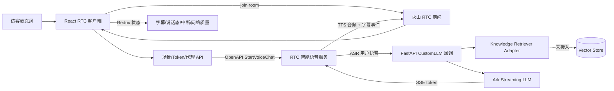

RTC 云承担双向实时媒体、ASR 和 TTS；自定义服务只负责知识检索与生成文字。前端监听远端用户、音频状态、字幕、AI 思考/说话、用户说话、中断和网络质量事件。

### 4.3 入口到出口完整流程

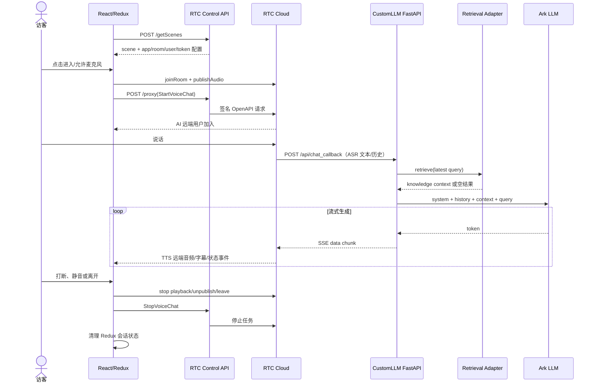

### 4.4 状态模型

```text
session: idle -> joining -> active -> stopping -> ended
                         \-> failed

turn: listening -> user_talking -> thinking -> ai_talking
       ^                                  |
       +----------- interrupt -----------+
```

前端现有状态还包括本地/远端用户、字幕开关、当前增量消息、已完成历史、自动播放失败、网络质量和全屏模式。目标平台应将 UI 临时态留在前端，将 session/turn/audit 状态归 Java，将低延迟 token/音频流留在 Python/RTC。

### 4.5 对抗性审查

| 问题 | 失败方式 | 融合要求 |
| --- | --- | --- |
| 源码中硬编码 RTC 标识/Token/配置 | 凭据泄漏、重放、环境串用 | 立即轮换；密钥只在密钥系统；客户端只拿短期 Token |
| 固定 room/task/user ID | 并发冲突、串听、跨会话回调 | 租户级随机 room/session，幂等 task ID，严格 TTL |
| 回调未见签名验证 | 外部伪造模型请求、消耗额度或注入内容 | 验证 Provider 签名、时间戳、nonce、来源和重放窗口 |
| 打印完整请求和知识上下文 | PII、对话、知识内容进入日志 | 结构化脱敏日志；正文默认不记录 |
| 检索走明文 HTTP | 跨主机时可窃听/篡改 | 内网 mTLS/服务身份；当前阶段只保留 adapter |
| Start/Stop 强耦合且缺幂等 | 网络重试造成多个语音任务或资源泄漏 | Java session 状态机 + Provider adapter + 幂等键 |
| 同意与保留策略缺失 | 录音/转写超用途使用 | 开始前同意、可见录音状态、保留期和删除工作流 |

### 4.6 融合结论

- **复用**：RTC 交互模型、字幕和打断状态、CustomLLM 流式协议。
- **改造**：Java 创建会话和授权；Python 做回调、检索和 LLM；Provider 通过适配器隔离。
- **拒绝**：硬编码凭据/房间、无签名回调、正文日志、进程内会话身份。
- **落位**：项目六“智能客服”下的“实时语音接待”。

---

## 5. 项目四：AI 运营

### 5.1 技术栈与模块

| 层 | 技术 | 关键源码 |
| --- | --- | --- |
| 前端 | Vue 3 + Vue Router | `frontend/src/router.js`、`WorkflowPage.vue`、`CalendarPage.vue`、`PosterPage.vue`、`VideoPage.vue` |
| API | FastAPI + Pydantic + SQLAlchemy async | `app/main.py`、`app/api/v1/*` |
| 工作流 | LangGraph 1.x + PostgreSQL checkpointer | `app/graph/workflow.py`、`state.py`、`nodes/*` |
| AI | OpenAI 兼容 LLM、图像 Provider、Tavily、TTS | `app/services/llm_service.py`、`image_service.py`、`tts_service.py` |
| 视频 | 独立 Express/Remotion 渲染服务 | `video-renderer/src/server.ts`、`render-video.ts`、`Root.tsx` |

它包含的业务模块为：登录与用户、品牌包、内容日历、LangGraph 写作、海报生成/编辑、批量任务、作品库、模板中心、Prompt 库、多平台改写、图片模型管理和 AI 视频。

### 5.2 总体架构

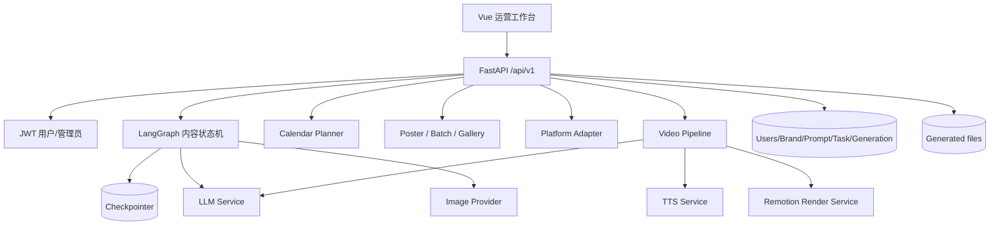

### 5.3 流程 A：选题、写作、审核、配图

LangGraph 状态包含 `topic_direction`、候选选题、已选选题、文章、审核意见、修改次数、视觉要点、图片 URL、状态、错误和每节点 token/耗时指标。

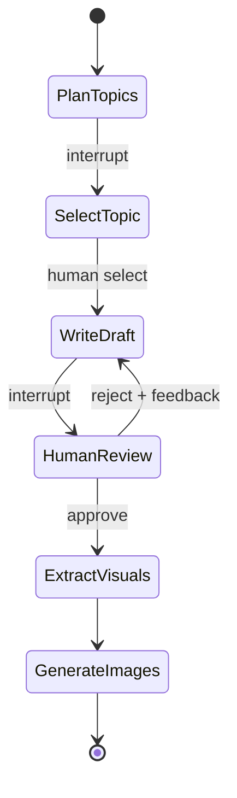

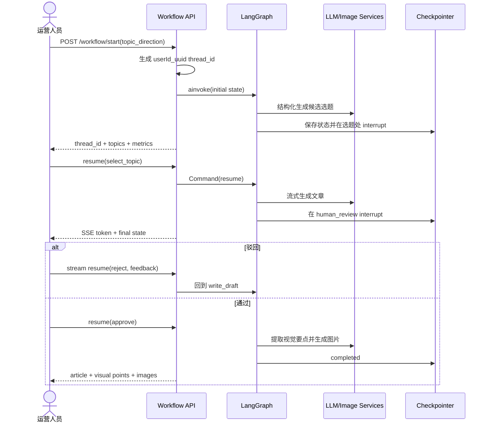

工作流接口通过 `thread_id` 的用户 ID 前缀做归属检查，这是五个项目中少数显式实现资源隔离的地方；但字符串前缀仍不应代替数据库资源授权。

### 5.4 流程 B：品牌、日历和多平台运营

```text
品牌包（Logo/色彩/语气/禁用词）
  + 月份/热点/营销目标
  -> AI 生成内容计划
  -> CalendarPlan + CalendarEvent
  -> 运营人员调整状态/日期/内容类型
  -> 从 Event 发起内容工作流
  -> 文章完成后按平台规则改写
  -> 小红书/公众号/抖音等 PlatformVariant
  -> 人工编辑与发布意图
```

平台适配服务会调整标题、长度、语气、标签和结构。目标平台必须把“生成平台版本”和“真正发布到渠道”分开：前者是 AI 结果，后者是带权限、审批、幂等和回执的渠道动作。

### 5.5 流程 C：海报、模板、批量与作品库

```text
自定义提示词 / 系统或个人模板 / 原图
  -> 合并品牌包、风格标签、比例、模型选择
  -> 生成提示词
  -> 图像模型：文生图、图生图、风格迁移、局部重绘、擦除、扩图
  -> 自动保存 Generation
  -> Gallery 搜索/标签/收藏/重命名
  -> 可保存为模板、Fork 或发布公共模板
  -> 多比例适配 / ZIP 导出 / 同步销售系统
```

批量服务在应用进程中维护任务并并发生成，提供状态轮询/SSE、失败重试和 ZIP。其业务能力可复用，任务实现需迁移到统一队列和租约模型。

### 5.6 流程 D：AI 视频

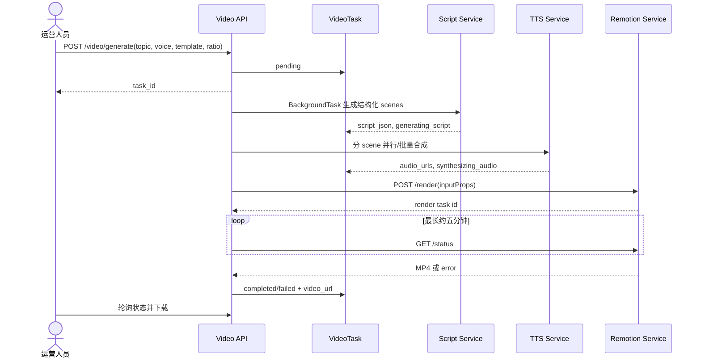

Remotion 支持知识卡片与数据可视化两类 composition。视频服务将脚本 scene 和 TTS 时长转换为渲染输入，限制同时渲染为 2 个；但 API BackgroundTask 与进程生命周期绑定。

### 5.7 对抗性审查

| 问题 | 失败方式 | 融合要求 |
| --- | --- | --- |
| CORS `*` 且允许凭据 | 浏览器跨域策略配置不严谨 | 明确租户前端域名；网关统一 CORS/CSRF 策略 |
| 视频接口缺少用户依赖 | 可查看、下载、删除他人视频；创建任务不绑定用户 | Java 资源所有权 + 短期下载 URL |
| BackgroundTask/进程内批量任务 | 部署重启即丢执行，横向扩展重复 | 队列、租约、幂等阶段、独立媒体 Worker |
| 生成文件放本地静态目录 | 多实例不一致、URL 可猜、删除不完整 | 对象存储 adapter + 权限下载；当前仅本地占位 |
| 工作流 `thread_id` 前缀授权 | 前缀碰撞/实现耦合，删除历史仍需严谨授权 | 资源表显式 tenant/user ownership |
| Prompt/模板发布边界 | 公共模板可能泄露租户信息或注入危险指令 | 审核、版本、静态扫描、作用域和回滚 |
| 直接同步销售系统 | AI 产物未经审批进入下游 | 生成 `sync_intent`，由 Java 权限和审批执行 |
| 供应商调用散落 | 重试、成本、脱敏和 Trace 不一致 | 统一模型/图像/TTS Provider Gateway |

### 5.8 融合结论

- **复用**：内容状态机、人审节点、品牌包、运营日历、海报工具、平台适配、Remotion 模板。
- **改造**：Java 持有 brief/task/review/publish intent；Python 执行图；统一任务队列与模型网关。
- **拒绝**：无归属的视频 CRUD、应用进程 BackgroundTask、本地 URL 作为永久资产、直写外部系统。
- **落位**：主要进入项目五“内容运营”；生成文件登记到项目四；效果进入项目七；模型配置进入项目八。

---

## 6. 项目五：MCP 多 Agent 共享服务集群

### 6.1 技术栈与组件

| 组件 | 技术/职责 | 关键源码 |
| --- | --- | --- |
| HTTP Gateway | FastAPI；API Key、日志、配额、REST 到 MCP | `mcp-demo/gateway/main.py`、`router.py`、`mcp_client_manager.py` |
| LLM Gateway | FastMCP；模型路由、Chat、Embedding | `shared/llm_gateway/server.py`、`router.py`、`doubao.py` |
| RAG Service | FastMCP + ChromaDB；文档分块、检索 | `shared/rag_service/server.py`、`retriever.py` |
| Memory Service | FastMCP + SQLite；会话记忆、用户事实 | `shared/memory_service/server.py`、`store.py` |
| Prompt Hub | FastMCP + JSON；原生 MCP Prompt | `shared/prompt_hub/server.py` |
| 示例业务 | 客服 Agent、写作 Agent、CLI/Web | `projects/customer_service/agent.py`、`writing_assistant/agent.py` |

### 6.2 网关架构

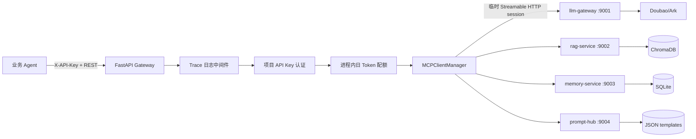

每次网关调用都会创建、初始化并关闭一个 MCP 会话，简单但有额外握手延迟。HTTP 网关负责 MCP 对外兼容，使普通业务前端/后端无需实现 MCP Client。

### 6.3 Tool 调用链

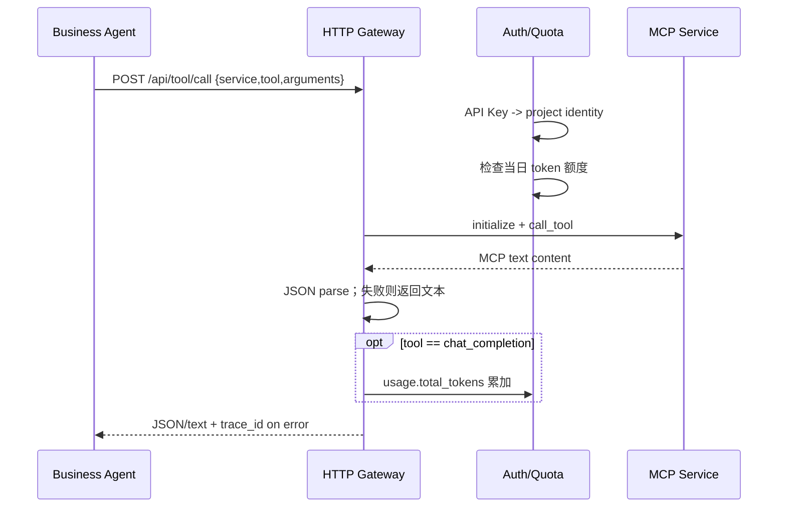

网关还提供 Prompt get/list、Tool list、健康检查和当前配额查询。

### 6.4 客服 Agent 完整流程

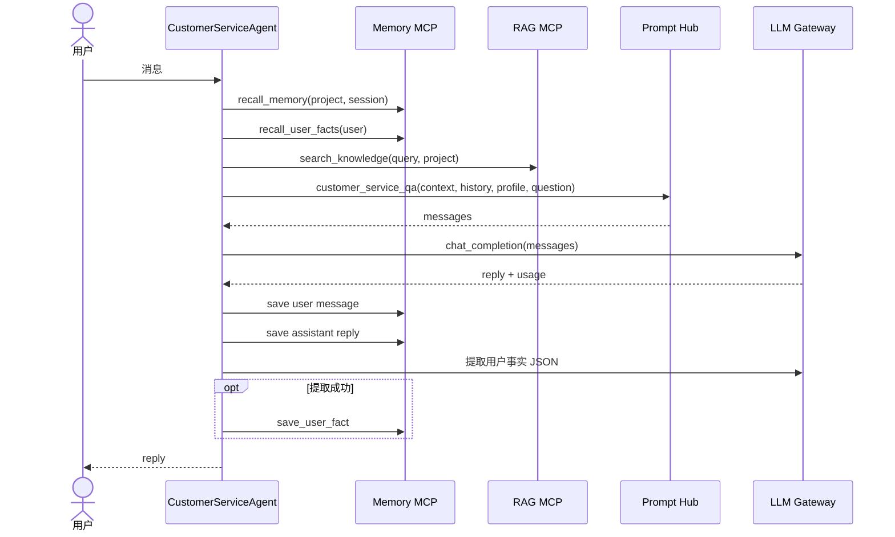

写作 Agent 使用相同骨架，只把 Prompt 换成 `writing_assistant`，RAG `top_k` 从 3 调到 5，输出上限更高，并允许正式/轻松/学术/幽默文风。说明共享能力与领域 Agent 的分层方向是正确的。

### 6.5 服务内部数据模型

- RAG：按 `project_id` 创建一个 Chroma collection，ID 为文档名与 chunk index，默认按 Markdown 二级标题和 500 字符切分。
- 记忆：`memory_messages(project_id, session_id, role, content)`；最近 N 条倒序查后再恢复正序。
- 用户事实：`user_facts(user_id, fact_key)` 唯一，跨项目共享，保留来源项目。
- Prompt：启动时扫描 JSON 文件，注册两个固定 MCP Prompt；没有数据库版本或审核状态。
- 配额：`project_id x date` 的 Python 内存字典，只统计 `chat_completion` 返回的 token。

### 6.6 对抗性审查

| 问题 | 失败方式 | 融合要求 |
| --- | --- | --- |
| 配置与示例代码含固定演示 Key | Key 被提交或不同环境复用 | 不迁入任何值；存储哈希/前缀，明文只显示一次 |
| 身份未绑定下游参数 | 已认证项目可在 arguments 中伪造别的 `project_id` | 网关删除调用方身份字段并注入可信 tenant/project scope |
| Tool 无细粒度授权 | 任意已认证项目可调用任意服务/Tool | 服务身份 + allowlist + purpose + resource scope |
| 用户画像跨项目裸共享 | 猜测 `user_id` 即可读写他人事实 | 全局主体映射、租户同意、字段级用途与来源校验 |
| 配额在进程内且事后扣减 | 多实例不一致；并发可超额；失败调用不计成本 | 原子预算预留、最终结算、所有模型/Embedding/图片/TTS 计费 |
| MCP 服务本身无认证 | 绕过 HTTP Gateway 可直接调用本地端口 | 网络隔离 + mTLS/service token；服务校验可信上下文 |
| Prompt 启动时静态加载 | 无版本、灰度、审批、回滚 | Prompt Registry：不可变版本 + alias + 审核状态 |
| RAG 隔离依赖 collection 名 | project_id 字符处理碰撞、无租户授权 | 索引命名用内部 UUID；过滤元数据并在控制面校验 |
| 事实提取直接覆盖 | LLM 幻觉可污染长期用户画像 | 候选事实、置信度、证据、确认/撤销和过期时间 |
| MCP 短连接 | 每次初始化增加延迟与故障点 | 初期内部 HTTP 契约；需要动态工具时再用连接池 MCP adapter |

### 6.7 融合结论

- **复用**：共享 Provider Gateway、Prompt Registry、Tool Catalog、检索/记忆接口、用量核算概念。
- **改造**：身份强制注入；工具级策略；分布式预算；Prompt 版本治理；AI Trace。
- **暂不接入**：ChromaDB、SQLite memory、真实 Embedding；使用明确的 `NotConnected` adapter。
- **落位**：共享能力集中在项目八；客服与写作 Agent 分别留在项目六和项目五，不能反向塞入“超级 Agent 平台”。

---

## 7. 五项目能力的统一取舍

| 能力 | 决策 | 原因 | 目标位置 |
| --- | --- | --- | --- |
| 浏览器 FFmpeg 音频抽取/片段导出 | 复用 | MVP 成本低，不上传大视频 | 内容资产前端 |
| ASR、视频分析、转码 | 复用并任务化 | Python/FFmpeg 生态成熟、资源模型特殊 | `ai/media-workers` |
| 原始聊天到人工标注发布链 | 复用领域模型 | 符合证据不可变原则 | 内容资产 + 智能客服 |
| 微信 SQLite 直连 | 暂缓 | 高敏、强环境依赖、非当前 MVP 必需 | 渠道 Connector 预留 |
| 销售考核 | 复用状态机 | 可形成知识到能力验证闭环 | 智能客服 + 经营分析 |
| RTC 实时语音 | 复用交互，适配 Provider | 实时链路应与控制面分离 | 智能客服 |
| LangGraph 内容工作流 | 复用 Python 执行图 | 适合 AI 节点和 human interrupt | 内容运营 AI Runtime |
| 审核、发布、资源归属 | Java 重建 | 需要事务、权限、审计和跨域一致性 | `ai-business-control` |
| 海报/视频/平台适配 | 复用能力，不复用单体 API | 业务价值高，现实现任务边界弱 | 内容运营 + 内容资产 |
| 模型路由、Prompt、Tool Catalog | 复用概念并统一 | 避免五项目各自调用 Provider | 模型与服务中心 |
| MCP 作为所有内部调用协议 | 暂不采用 | 增加握手与运维复杂度，业务契约不需动态发现 | 可选 Tool Adapter |
| 外部项目数据库/向量库 | 不接入 | 用户明确要求只保留位置 | Adapter + 空状态 |

---

## 8. 商媒智营目标架构

### 8.1 逻辑架构

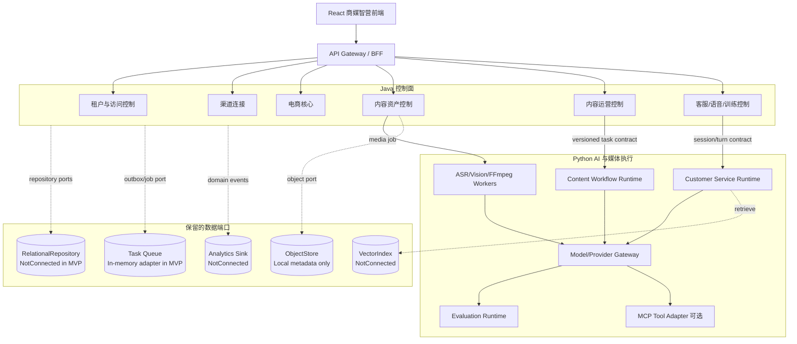

### 8.2 物理目录

```text
AIPlatform/
  frontend/                         # 唯一产品前端，保持当前视觉系统
  backend/
    core-control-plane/             # Java：IAM、渠道、电商事实
    ai-business-control/            # Java：资产、内容、客服、审批、任务
  ai/
    runtime/                        # Python：模型网关、内容/客服图、评测、工具适配
    media-workers/                  # Python：ASR、OCR、Vision、FFmpeg、Remotion 调度
  data/
    analytics/                      # 指标、质量、报表；MVP 仅契约
  packages/
    contracts/                      # OpenAPI、事件 Schema、错误码、Trace 字段
  infra/                            # 本地/测试/部署配置；不放业务代码和密钥
  docs/                             # 架构决策、流程与验收标准
```

这里不是“三个项目文件夹：前端、后端、AI”。从部署上看可以概括为三类运行时，但后端必须继续分成 Java 核心控制、Java AI 业务控制、Python AI Runtime、Python 媒体 Worker、分析栈，避免权限事务、实时 AI 和 CPU/GPU 媒体任务互相拖垮。

### 8.3 Java 与 Python 责任边界

| 能力 | Java 控制面 | Python 执行面 |
| --- | --- | --- |
| 身份与租户 | 认证、RBAC/ABAC、店铺/资源范围、服务身份 | 只验证控制面签发的短期服务令牌 |
| 任务 | 创建、幂等、状态、租约、取消、重试政策、审计 | 领取 attempt、执行、心跳、提交结构化结果 |
| 内容工作流 | Brief、版本、审批、发布意图、渠道回执 | 选题、写作、视觉、改写、评价节点 |
| 资产 | 元数据、版本、版权、保留策略、谱系 | 解析、ASR、OCR、切片、转码、渲染 |
| 客服 | 会话、消费者/订单引用、接管、工单、SLA | 检索、回答候选、语音回调、摘要、质检建议 |
| 销售考核 | 试卷发布、Attempt、人工复核、最终分 | 出题候选、逐题评分建议、反馈建议 |
| 模型治理 | 谁可配置/启停/授权，变更审计 | Provider 调用、路由、熔断、用量、Trace、评测 |
| 发布/外部写操作 | 唯一执行者 | 只能生成 action proposal，不直接写渠道 |

禁止事项：Python 不直写 Java 业务表；Java 不在请求线程中执行 FFmpeg/模型推理；前端不提交可信 `tenant_id`；Analytics/Vector 不反写业务事实。

### 8.4 统一调用信封

所有 Java -> Python 任务都使用版本化信封。示意：

```json
{
  "schema_version": "ai-task.v1",
  "task_id": "opaque-uuid",
  "attempt": 1,
  "idempotency_key": "tenant:operation:input-version",
  "tenant_context": {
    "tenant_id": "trusted-internal-id",
    "subject_id": "trusted-user-or-service-id",
    "purpose": "content.generate",
    "resource_scope": ["asset-version-id"]
  },
  "trace": {
    "trace_id": "uuid",
    "requested_at": "RFC3339"
  },
  "input_refs": [],
  "parameters": {}
}
```

Python 回写只提交结果候选：

```json
{
  "task_id": "opaque-uuid",
  "attempt": 1,
  "status": "succeeded",
  "output_schema": "clip-plan.v1",
  "output": {},
  "evidence_refs": [],
  "ai_trace_id": "uuid",
  "usage": { "input_tokens": 0, "output_tokens": 0, "cost_micros": 0 }
}
```

控制面验证 task、attempt、tenant、Schema 和状态转换后才登记业务版本。Worker 不能通过结果载荷改变归属或跳过审批。

### 8.5 统一任务状态机

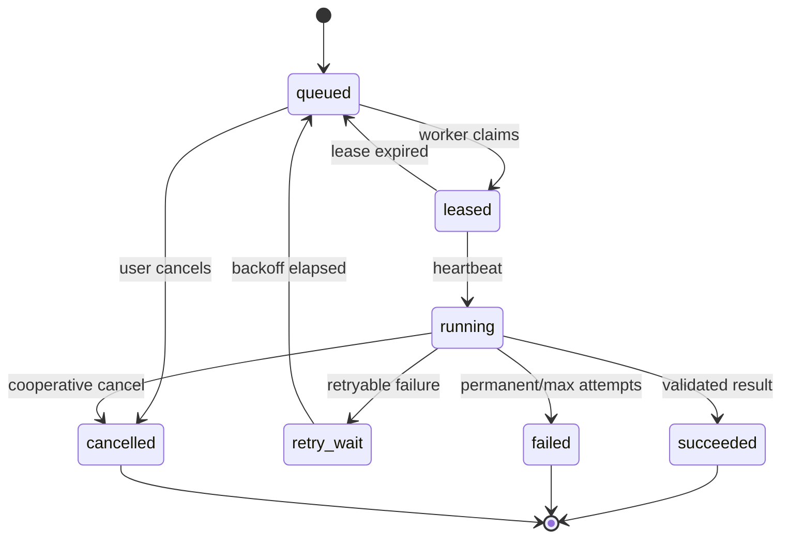

每个阶段记录 `attempt`、`lease_owner`、`lease_until`、`heartbeat_at`、错误分类和下一次重试时间。Provider 的 429/5xx、Schema 错误、输入错误和权限错误必须分类，不能一律重试。

### 8.6 数据库和向量库保留端口

MVP 不连接真实存储，但接口要先稳定：

```text
AssetRepository          ContentBriefRepository
ConversationRepository   AssessmentRepository
TaskRepository           AiTraceRepository
ObjectStore              VectorIndex
EventPublisher            AnalyticsSink
```

适配器状态只有三类：

- `memory`：本地浏览器或进程内演示数据，可操作但不承诺持久性。
- `not_connected`：保留接口，调用返回明确的 `DEPENDENCY_NOT_CONNECTED`，绝不伪造成功。
- `provider`：后续显式配置的数据库、对象存储、向量库或消息队列。

向量索引接口至少携带：`tenant_id`、`knowledge_release_id`、`embedding_model`、`dimension`、`chunker_version`、`document_version` 和过滤元数据。切换模型必须新建索引版本，不能在原 collection 中混写不同维度。

---

## 9. 融合后的端到端业务流程

### 9.1 直播切片闭环

```text
浏览器选择视频
  -> Java 登记本地待处理资产意图
  -> 浏览器抽音频并上传到 ObjectStore adapter
  -> Java 创建 media_job，发出任务
  -> Python ASR + 切片分析
  -> Java 校验 clip-plan.v1 并登记衍生版本
  -> 运营人员审核时间码/标题
  -> 浏览器 FFmpeg 导出（MVP）或创建服务端导出任务
  -> 产物登记到内容资产谱系
  -> 可转为内容运营 Brief
```

出口不是“生成一个 ZIP”这么简单，而是一个有来源、有版权、有审核状态的衍生资产版本。

### 9.2 营销内容闭环

```text
选择店铺/商品事实 + 品牌包 + 素材版本 + 目标渠道
  -> Java 创建 ContentBrief v1
  -> Python 工作流生成候选选题
  -> 人工选择
  -> Python 生成文章/海报/视频脚本候选
  -> Java 保存不可变 ContentVersion
  -> 人工驳回重生成或通过
  -> Python 生成平台变体
  -> Java 创建 PublishIntent
  -> 渠道连接器执行并回传 receipt
  -> 内容效果事件进入 Analytics
```

事实输入使用 ID + version 引用，不能把可变商品详情直接复制进 Prompt 后失去版本关系。

### 9.3 聊天知识发布与客服闭环

```text
渠道接收聊天原始事件
  -> 内容资产登记不可变证据
  -> 清洗/分组生成 staging 候选
  -> 标注员编辑、脱敏和批准
  -> Java 发布 KnowledgeRelease
  -> VectorIndex adapter 构建索引（MVP 未接入）
  -> 客服会话收到问题
  -> Python 召回证据并生成带引用的回答候选
  -> 低风险自动答复 / 高风险人工确认
  -> 无法解决时 Java 创建工单
  -> 质检、解决率和引用命中率进入 Analytics
```

知识发布单位应是不可变 `release`，线上会话固定引用某个 release/alias，防止索引更新导致同一问题无法复现。

### 9.4 实时语音接待闭环

```text
用户同意录音/转写
  -> Java 创建 tenant-scoped VoiceSession
  -> RTC adapter 签发短期 room token
  -> 客户端入房并启动 VoiceTask（幂等）
  -> RTC ASR 调用签名过的 Python callback
  -> Python 检索 adapter + 模型网关流式返回
  -> RTC TTS 播放并发字幕
  -> 打断时终止当前 turn，不结束 session
  -> 离房时 Java Stop + 状态收敛
  -> 按保留策略保存摘要/转写引用或立即删除
  -> 必要时转人工/工单
```

### 9.5 销售训练与考核闭环

```text
培训负责人选择已发布知识版本
  -> Python 生成试题候选
  -> 人工审题并由 Java 发布 QuizVersion
  -> 学员作答并提交 Attempt
  -> Python 按冻结量表给逐题建议
  -> Java 保存 AIGrade（不可作为最终分直接覆盖）
  -> 负责人人工复核/调整并填写理由
  -> FinalGrade 发布
  -> 能力项、知识薄弱点进入经营分析
```

### 9.6 模型调用与治理闭环

```text
领域任务携带 purpose、预算和模型能力要求
  -> Java 授权并预留预算
  -> Python 路由到已启用 Provider/ModelDeployment
  -> 执行脱敏、限流、超时、重试、熔断
  -> 记录 Prompt version、模型、工具、引用、token、延迟和错误
  -> 返回结构化候选
  -> Java 结算预算并关联领域结果
  -> 评测与线上反馈产生质量指标
  -> 模型/Prompt 可灰度、回滚或停用
```

---

## 10. 前端信息架构与 MVP 范围

保留商媒智营现有导航与视觉系统，不为五个来源项目增加新的一级产品。外部能力按业务目的进入现有工作台：

| 一级项目 | 工作台 Tab | MVP 可操作内容 | 当前依赖状态 |
| --- | --- | --- | --- |
| 内容资产 | 资产总览、直播切片、销售素材 | 本地创建切片任务、阶段推进、素材登记 | 数据库/对象存储未接入 |
| 内容运营 | 运营简报、内容工作流、运营日历、海报与视频 | 创建 Brief、选题、审批、查看衍生产物 | Provider 未接入，使用演示候选 |
| 智能客服 | 会话、知识发布、实时语音、销售训练 | 创建知识发布、模拟会话、语音 session、考核状态 | 向量库/RTC 未接入 |
| 经营分析 | 业务指标、内容效果、销售能力、AI 质量 | 展示口径与空状态/本地事件汇总 | Analytics Sink 未接入 |
| 模型与服务 | 模型、API Key、Prompt、工具服务、调用与预算 | 现有 CRUD/启停 + 本地 Prompt/Tool/预算管理 | Provider/Trace DB 未接入 |

MVP 页面必须清楚区分三种状态：真实已完成的本地操作、待执行的任务模拟、尚未接入的基础设施。不能用伪造的增长数字或“已同步”提示掩盖依赖缺失。

---

## 11. 分阶段实施

### 阶段 0：当前可交付 MVP

- 保留现有 React 风格与八项目导航。
- 建立五类融合工作台和本地租户隔离状态。
- 用内存/localStorage 演示创建、审核、启停和状态转换。
- 在每个依赖位置显示数据库、向量库、RTC、对象存储未接入。
- 定义共享任务、AI Trace、资产版本、知识发布和考核契约草案。

### 阶段 1：工程脊柱

- Java IAM、租户上下文、资源授权和审计。
- Java 统一任务控制面，先使用单实例持久任务表。
- Python Model Gateway 和两个 Worker：内容、媒体。
- 对象存储与关系库接入；仍不启用向量检索。
- 完成“视频 -> 切片计划 -> 人审 -> 浏览器导出”和“Brief -> 文案 -> 人审”两条闭环。

### 阶段 2：知识与客服

- 原始会话证据、Staging、标注、KnowledgeRelease。
- 先做全文/关键词检索，再接向量索引 adapter。
- 文本客服、人工接管、工单和质检。
- RTC Provider adapter、短期 Token、签名回调和转写保留策略。

### 阶段 3：运营扩展与考核

- 海报 Provider、批量生成、Gallery、品牌和日历。
- Remotion 独立渲染 Worker。
- 销售试卷、AI 建议分、人工复核与申诉。
- 多平台发布意图、渠道执行和效果回流。

### 阶段 4：规模化治理

- 分布式队列/租约、预算预留与结算、熔断降级。
- Prompt Registry、Tool Catalog、自动/离线评测、灰度路由。
- Analytics 指标语义、数据质量和成本分析。
- 仅在需要动态 Agent 工具发现时启用 MCP adapter。

---

## 12. 对抗性总审查与上线闸门

### 12.1 威胁与故障矩阵

| 场景 | 最坏后果 | 必须的控制 | 上线验证 |
| --- | --- | --- | --- |
| 调用方伪造 tenant/project ID | 跨租户聊天、知识、模型和账单泄漏 | 边缘剥离外部身份字段，服务端上下文注入 | 用租户 A 凭证请求 B 资源恒为 404/403 |
| Worker 重复消费 | 重复扣费、重复发布、重复生成文件 | idempotency key、attempt、唯一结果约束 | 注入重复消息只产生一个业务版本 |
| Provider 超时后实际成功 | 重试造成重复外部任务 | Provider request id + 状态查询 + 不确定状态 | 模拟响应丢失可最终收敛 |
| Prompt 注入诱导工具写操作 | 越权发布/退款/泄密 | Tool allowlist、参数 Schema、策略审批、只读默认 | 恶意知识文本无法提升工具权限 |
| RAG 返回越租户片段 | 商业数据泄漏 | 发布/索引双重租户过滤，引用授权复核 | 跨租户检索测试为零命中 |
| 日志记录正文/Token/Key | 凭据与 PII 长期泄漏 | 字段白名单、脱敏、采样、密钥扫描 | 日志测试中无正文和 Secret |
| 模型输出非法 JSON | 状态机卡死或错误业务动作 | Schema、修复重试、失败队列、人工处理 | 模糊测试无未捕获异常 |
| AI 评分偏差 | 员工受到不公平考核 | 冻结量表、人工最终裁决、校准/申诉 | 同一评测集版本分布可追踪 |
| RTC 回调重放 | 额度消耗、串话、错误回复 | 签名、nonce、时间窗、session/turn 校验 | 重放第二次被拒绝 |
| 删除只删元数据 | 音频/视频/索引仍残留 | 删除编排、对象清单、索引 tombstone、证明 | 删除后所有投影不可检索 |
| 浏览器 FFmpeg 资源耗尽 | 页面崩溃、未完成导出 | 文件大小/时长检查、取消、服务端降级 | 低内存/移动端明确提示与恢复 |
| 模型/Embedding 切换 | 索引维度错配、结果漂移 | 版本化 deployment/index、蓝绿重建 | 新旧索引可并行与回滚 |

### 12.2 上线前不可妥协项

1. 所有业务资源查询有租户过滤和资源授权测试。
2. 所有密钥来自 Secret Manager/环境注入，代码库扫描无真实值。
3. 所有耗时任务支持幂等、重试分类、取消、租约过期和状态审计。
4. AI 输出全部通过版本化 Schema；高风险动作需要人工或确定性策略。
5. 每个 AI 结果可定位输入版本、Prompt、模型、工具、证据和成本。
6. RTC 回调有签名/重放保护，录音与转写有同意和删除策略。
7. 知识发布与索引按不可变 release 管理，可重建、可回滚。
8. 数据库/向量库未接入时返回明确错误或空状态，不假装成功。

---

## 13. 验收标准

### 13.1 架构验收

- 五个来源项目的能力全部映射到现有八域，没有新增孤立产品。
- Java/Python/浏览器/Provider 的职责和信任边界清晰。
- 数据库、对象存储、向量库和消息队列均通过端口隔离。
- 任务、内容版本、知识发布、会话、考核和 AI Trace 有明确状态模型。

### 13.2 前端 MVP 验收

- 保持现有商媒智营布局、颜色、字体、间距和交互密度。
- 内容资产可看到直播切片和销售素材入口。
- 内容运营可走完创建 Brief、生成候选、人工通过/驳回的本地演示。
- 智能客服可查看知识、语音与销售训练状态，同时明确外部依赖未接入。
- 经营分析展示指标口径而非伪造业务数据。
- 模型与服务中心除模型/API Key 外，包含 Prompt、工具服务和用量治理入口。
- 所有本地记录按当前租户隔离，刷新后仍可恢复。

### 13.3 安全验收

- 没有复制五项目的 `.env`、数据库、dump、Token、API Key、录音、聊天或生成媒体。
- UI 不显示或记录完整 API Key；新建时只显示一次。
- 外部依赖未配置时，不发起真实 Provider、RTC、数据库或向量调用。

---

## 14. 源码证据索引

本次关键判断来自以下真实调用入口：

| 项目 | 入口与核心文件 |
| --- | --- |
| AI 切片 | `backend/app/api/upload.py`、`tasks.py`、`clips.py`、`services/task_runner.py`、`workers/pipeline.py`、`frontend/src/services/audioExtractor.ts`、`videoClipExporter.ts` |
| 数据中台/考核 | `backend/app/services/etl.py`、`routers/admin.py`、`labeling.py`、`materials.py`、`quiz.py`、`services/quiz.py`、`models/chat.py`、`frontend/src/appRoutes.ts` |
| AI 语音 | `src/pages/MainPage/index.tsx`、`MainArea/Antechamber/index.tsx`、`MainArea/Room/index.tsx`、`src/lib/RtcClient.ts`、`listenerHooks.ts`、`rag_llm_server/main.py`、`services/rag_service.py` |
| AI 运营 | `app/main.py`、`graph/workflow.py`、`graph/state.py`、`graph/nodes/*`、`api/v1/workflow.py`、`poster.py`、`calendar.py`、`video.py`、`services/video_service.py`、`video-renderer/src/server.ts` |
| MCP 集群 | `mcp-demo/gateway/main.py`、`auth.py`、`quota.py`、`router.py`、`mcp_client_manager.py`、`shared/*/server.py`、`projects/customer_service/agent.py`、`writing_assistant/agent.py` |

这份索引用于后续实现时回看源行为，不代表允许直接复制源码。真正进入商媒智营的是经过租户、权限、任务、审计和数据所有权重新设计后的能力。
